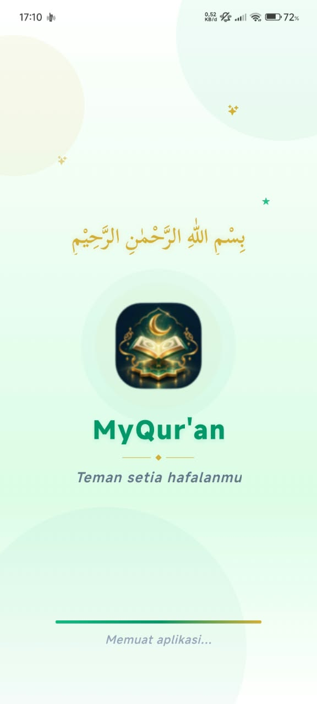
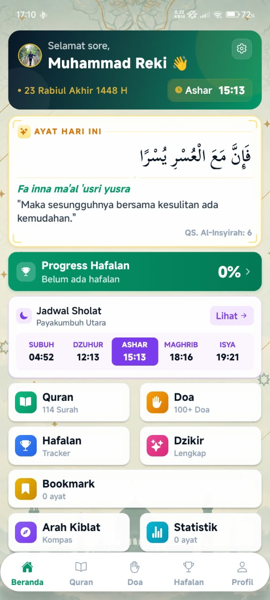
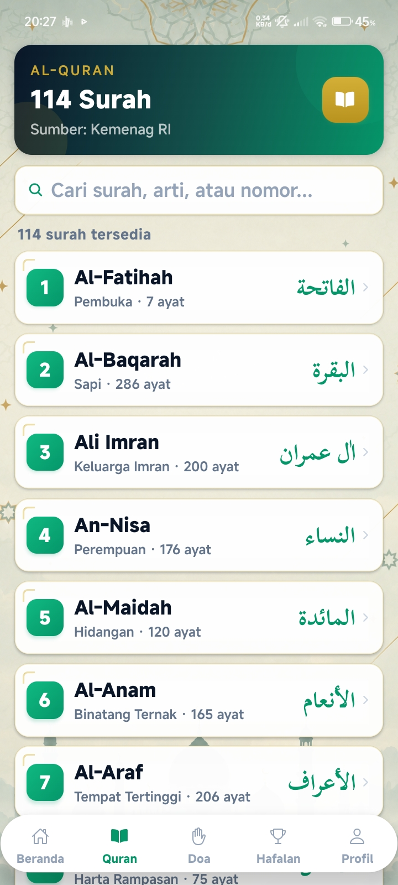
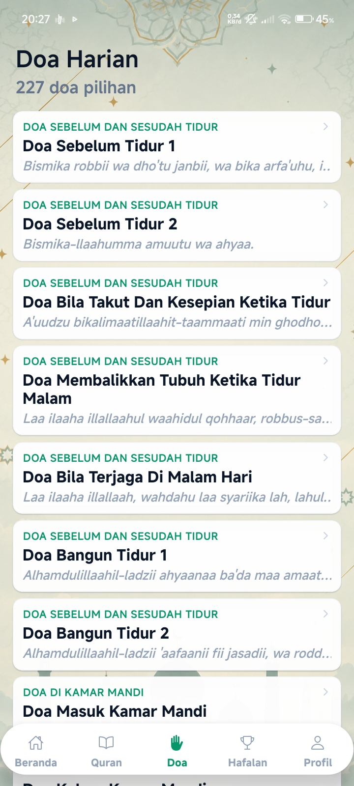
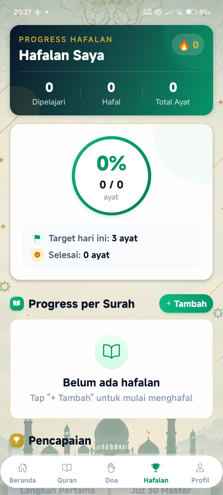
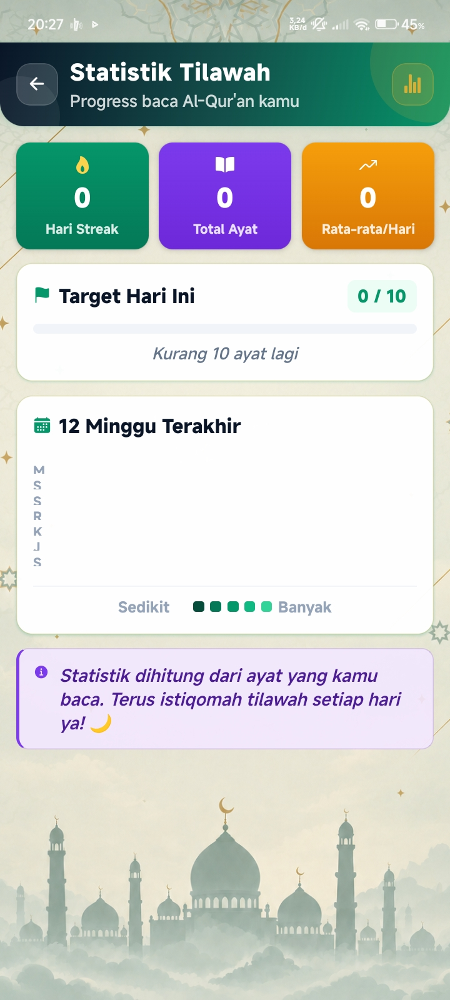
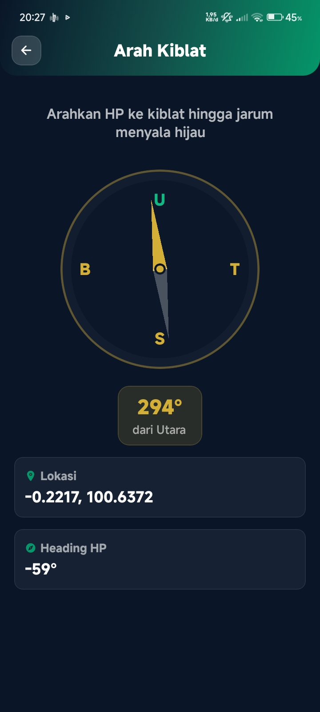
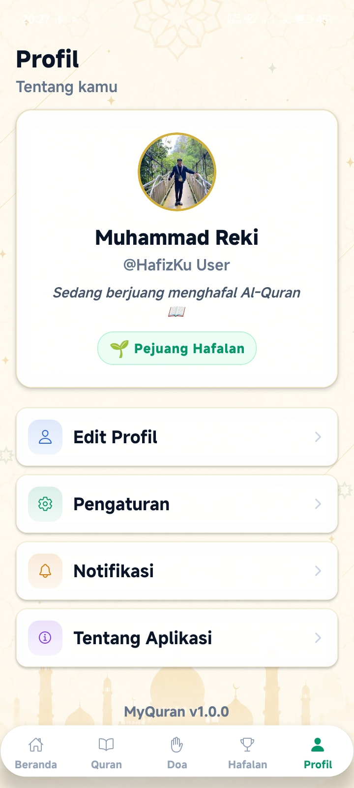

# 📖 MyQur'an — Teman Setia Hafalanmu

<div align="center">

**Aplikasi Al-Qur'an digital lengkap untuk menemani perjalanan tilawah dan hafalanmu.**

[](https://www.android.com/)
[](https://reactnative.dev/)
[](https://expo.dev/)
[](LICENSE)

</div>

---

## 📖 Tentang Aplikasi

**MyQur'an** adalah aplikasi Al-Qur'an digital yang dirancang untuk membantu pengguna dalam tilawah, hafalan, dan ibadah harian. Aplikasi ini dibangun dengan **React Native & Expo**, dengan fokus pada:

- 🎨 **Desain islami modern** — nuansa hijau emas yang elegan
- 🚀 **Performa cepat** — ringan dan responsif
- 📖 **Fitur lengkap** — dari baca surah hingga kompas kiblat
- 🤍 **Gratis selamanya** — tanpa iklan, tanpa biaya

---

## ✨ Fitur Unggulan

| Fitur | Deskripsi |
|-------|-----------|
| 📚 **Al-Qur'an 114 Surah** | Teks Arab, latin, terjemahan, dan catatan kaki (Sumber: Kemenag RI) |
| 📌 **Bookmark Ayat** | Tandai ayat favorit dengan tekan lama |
| 📊 **Statistik Tilawah** | Heatmap progress harian seperti GitHub |
| 🧭 **Arah Kiblat** | Kompas real-time menggunakan sensor HP |
| 🕌 **Jadwal Sholat** | Waktu sholat real-time sesuai lokasi |
| 🏆 **Hafalan Tracker** | Catat progress hafalan & target harian |
| 📿 **Doa & Dzikir** | 227 doa pilihan + dzikir lengkap |
| 🎨 **Desain Islami Modern** | Nuansa hijau emas yang elegan |
| 🔍 **Pencarian** | Cari surah, doa, atau ayat dengan cepat |
| 🌙 **Mode Terang & Gelap** | Nyaman dibaca siang & malam |

---

## 📸 Screenshots

<div align="center">

### 🌙 Splash Screen



### 🏠 Tampilan Utama

<table>
  <tr>
    <td align="center"><b>Beranda</b></td>
    <td align="center"><b>Quran</b></td>
    <td align="center"><b>Doa</b></td>
  </tr>
  <tr>
    <td></td>
    <td></td>
    <td></td>
  </tr>
</table>

<table>
  <tr>
    <td align="center"><b>Hafalan</b></td>
    <td align="center"><b>Statistik Tilawah</b></td>
    <td align="center"><b>Arah Kiblat</b></td>
  </tr>
  <tr>
    <td></td>
    <td></td>
    <td></td>
  </tr>
</table>

### 👤 Profil



</div>

---

## 🚀 Cara Install

### 📱 Untuk Pengguna

1. **Download APK** dari [Releases](https://github.com/MuhammadReki/alquran/releases)
2. **Aktifkan** "Install from unknown sources" di HP
3. **Install APK** → buka app
4. **Selesai!** 🎉

### 💻 Untuk Developer

```bash
# 1. Clone repository
git clone https://github.com/MuhammadReki/alquran.git
cd alquran

# 2. Install dependencies
npm install

# 3. Jalankan development server
npx expo start

# 4. Build untuk Android
npx expo run:android

# 5. Atau build APK via EAS
eas build --platform android --profile production